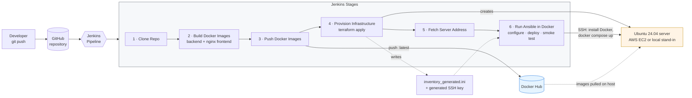
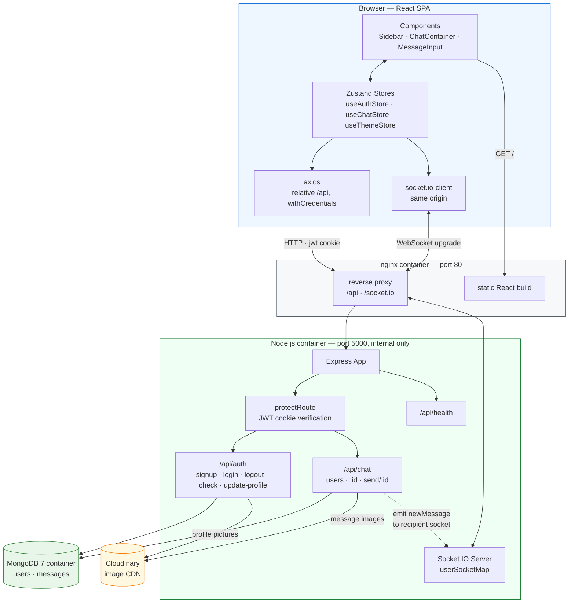
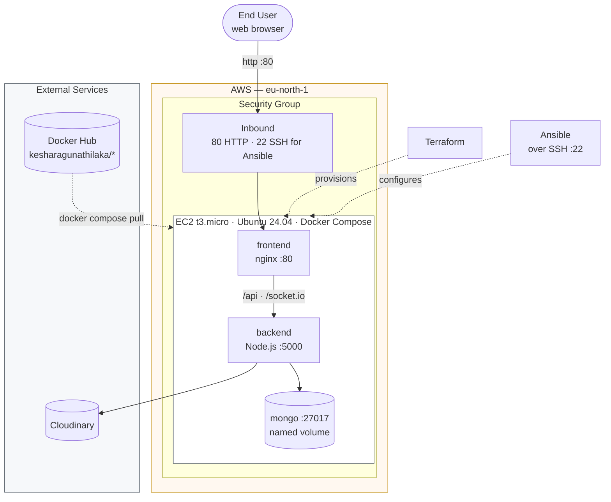
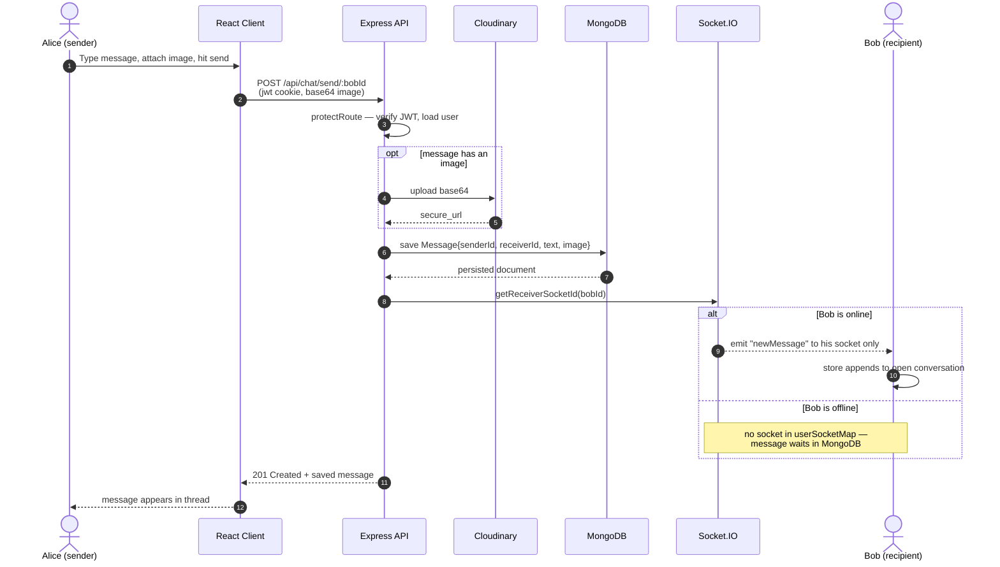
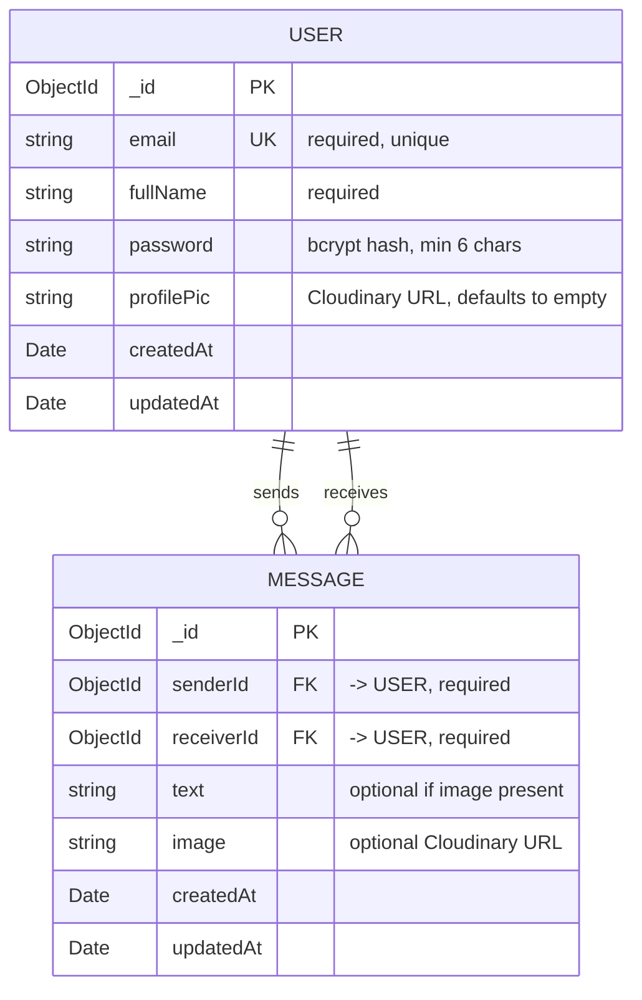

# Real-Time Chat — MERN Application with a Full CI/CD & IaC Pipeline

> A one-to-one real-time chat application with a six-stage Jenkins pipeline that builds containers, provisions a server with Terraform — on AWS EC2 or a free local EC2 stand-in — and deploys to it with Ansible, from a single trigger.

[](https://nodejs.org/)
[](https://react.dev/)
[](https://vitejs.dev/)
[](https://socket.io/)
[](https://www.mongodb.com/)
[](https://www.docker.com/)
[](https://www.jenkins.io/)
[](https://www.terraform.io/)
[](https://www.ansible.com/)
[](https://aws.amazon.com/ec2/)
[](LICENSE)


---

## Overview

Deploying a web application by hand is slow, undocumented, and different every time somebody does it. Someone SSHes into a box, pulls a branch, installs a runtime they forgot to write down, and the next person cannot reproduce it.

This project removes that step entirely. A push to the repository triggers a Jenkins pipeline that containerises both tiers of a real-time chat application, publishes the images to Docker Hub, **provisions a brand-new server from scratch with Terraform** — an AWS EC2 instance, or a local Ubuntu server that stands in for one — writes the Ansible inventory and SSH key for the server it just created, and uses Ansible to install Docker and bring up the whole stack — web server, API and database — on that freshly-created machine, finishing with a health check.

The result: infrastructure that did not exist when the build started is running the application by the time it finishes, with no manual step in between.

The application itself — **UniChat** — is a one-to-one messaging app — real-time delivery over WebSockets, presence tracking, image attachments, and JWT authentication — chosen because it exercises the parts of a deployment that are genuinely awkward to automate: persistent connections, cross-origin rules, and per-environment configuration.

## Scope & Attribution

Being precise about what is what:

**The DevOps layer is our own work.** Docker images for both tiers, the Jenkins declarative pipeline, the Terraform configuration for EC2 and its security group, the Ansible playbooks, the Terraform-to-Ansible inventory handoff, and the environment-driven configuration model — all built by us for this module.

**The application layer is adapted from an open-source MERN chat implementation.** The React frontend and Express backend are based on a publicly available MERN real-time chat project. We modified it where the deployment required it — most substantially, replacing the hardcoded `localhost` origins that made it undeployable (see [Challenges](#challenges--what-we-learned)) — but we did not write the base application from scratch, and it would be wrong to imply otherwise.

This split is deliberate rather than a shortcut. The module assesses the pipeline, not CRUD code, and taking an application you did not write and making it deploy reproducibly is a closer match to real infrastructure work than deploying something built to be convenient for you.

## Features

**Application**
- Real-time one-to-one messaging over WebSockets — no polling, no refresh
- Live online/offline presence, updated as users connect and disconnect
- Image attachments, uploaded to Cloudinary rather than stored on the app server
- JWT authentication in an `httpOnly`, `sameSite=strict` cookie — not `localStorage`
- bcrypt password hashing with a per-user generated salt
- 32 selectable UI themes with light/dark support, persisted across sessions

**Infrastructure**
- Three-service Docker Compose stack — nginx, Node.js API, MongoDB — with healthchecks and restart policies
- nginx serves the React build and reverse-proxies REST and WebSocket traffic, so the browser sees a single origin
- Six-stage Jenkins declarative pipeline, credentials injected from Jenkins' credential store
- Two deploy targets from one pipeline: AWS EC2, or a local EC2 stand-in for zero-cost end-to-end runs — same playbook for both
- EC2 instance, security group and SSH key pair defined as code in Terraform
- Terraform writes the Ansible inventory for the server it just created — no manual handoff
- Idempotent Ansible playbook: Docker, swap, secrets, `docker compose up`, then a smoke test
- Ansible runs inside a container, so the Jenkins agent needs no Ansible install
- Environment-driven configuration — the same images run locally and on AWS

## Tech Stack

| Layer | Technology |
|---|---|
| Frontend | React 18, Vite 6, Zustand, Tailwind CSS, daisyUI, Framer Motion |
| Backend | Node.js 18, Express 4, Socket.IO 4 |
| Database | MongoDB 7 (container, persistent volume), Mongoose ODM |
| Auth | JSON Web Tokens, bcryptjs, httpOnly cookies |
| Media | Cloudinary |
| Logging | Winston (console + file transports) |
| Web server | nginx (static hosting + reverse proxy for REST and WebSocket) |
| Containers | Docker, Docker Compose (health-checked services) |
| CI/CD | Jenkins (declarative pipeline) |
| IaC | Terraform (AWS provider) |
| Config Mgmt | Ansible |
| Cloud | AWS EC2 (`eu-north-1`, `t3.micro`) |

## Architecture

> **Interactive version:** [`docs/architecture.html`](docs/architecture.html) is a self-contained
> animated walkthrough of both diagrams below — step through the pipeline stage by stage, or follow a
> single chat message from one browser to another. Clone the repo and open it in any browser; no build
> step and no network access required.

### CI/CD Pipeline

One trigger takes the project from source to a running, health-checked application. Stage 4 is the interesting one: Terraform creates a server that did not previously exist, generates the key to reach it, and writes the Ansible inventory from it — so stage 6 can configure a machine that was not there when the build started. A `DEPLOY_TARGET` build parameter decides whether that server is an AWS EC2 instance or the local stand-in; every other stage is identical.



### Application Architecture

nginx is the only public entry point. It serves the compiled React app and reverse-proxies both `/api` (REST) and `/socket.io` (WebSocket) to the Node.js container, so the browser only ever talks to one origin. That removed the cross-origin configuration that originally made the app undeployable, and it means the frontend image needs no knowledge of the server's address.



### Deployment Topology



This is the AWS target. The local target reproduces it on one machine: the server is a container, its port 80 is published as `localhost:8088`, and Ansible reaches it over a Docker network instead of the internet.

Only nginx publishes a port; the API and database are reachable only on the Compose network. Startup is ordered by healthchecks: MongoDB must answer a ping before the API starts, and the API's `/api/health` must report a live database connection before nginx starts taking traffic.

## How a Message Travels

The part worth understanding: sending a message uses **two different transports**. The sender gets an HTTP response confirming persistence; the recipient gets a WebSocket push targeted at their specific socket ID — not a broadcast. Users who are offline simply have no socket in the map, and collect the message from the database when they next open the conversation.



## Data Model

Two collections. `Message` carries a self-referencing pair of user references — sender and recipient both point back to `User`, which is what makes a conversation query a single `$or` over both directions.



## Getting Started

### Prerequisites

| Tool | Version | Needed for |
|---|---|---|
| Docker + Compose | 24+ | Container workflow; also runs MongoDB and Ansible |
| Node.js | 18+ | Running without Docker, and the smoke test |
| Terraform | 1.5+ | AWS provisioning |
| Cloudinary | free tier | Image uploads |
| AWS account | — | Only for the `aws` deploy target |
| Jenkins | 2.x, Windows agent | The automated pipeline |

Ansible does not need installing: every playbook run happens inside the `alpine/ansible` container.

### Environment Variables

Copy the example files and fill in real values. Both `.env` files are gitignored and excluded from the Docker build context — no secrets are committed to this repository or baked into an image.

```bash
cp backend/.env.example backend/.env
cp frontend/.env.example frontend/.env
```

**`backend/.env`**

| Variable | Description |
|---|---|
| `PORT` | API listen port. Defaults to `5000`. |
| `NODE_ENV` | `development` or `production`. |
| `COOKIE_SECURE` | `true`/`false`. Marks the auth cookie HTTPS-only. Defaults to `true` unless `NODE_ENV=development`; set `false` when serving over plain HTTP, or browsers silently drop the cookie and login never sticks. |
| `ORIGIN` | Origin allowed by CORS for REST and the Socket.IO handshake. Must match the URL the browser loads, port included, no trailing slash. |
| `LOG_LEVEL` | Winston level: `error`, `warn`, `info`, `debug`. Defaults to `info`. |
| `MONGO` | MongoDB connection string. Compose sets this for you. |
| `JWT_SECRET` | Long random string for signing tokens. In deployments Ansible generates one on the server if none is supplied. |
| `CLOUDINARY_CLOUD_NAME` / `CLOUDINARY_API_KEY` / `CLOUDINARY_API_SECRET` | Cloudinary dashboard credentials. |

**`frontend/.env`** — only for `npm run dev`; the Docker image uses neither.

| Variable | Description |
|---|---|
| `VITE_API_BASE_URL` | Base URL for REST calls. Unset falls back to relative `/api`. |
| `VITE_BASE_URL` | Origin for the Socket.IO client. Unset means same origin. |

> Only variables prefixed `VITE_` are exposed to browser code — never put a secret in one.

### Run with Docker Compose (recommended)

```bash
git clone https://github.com/KesharaGunathilaka/DevOps_RealTimeChat.git
cd DevOps_RealTimeChat
docker compose up --build
```

Open <http://localhost:3000>. This builds all three services from source and runs the same nginx → API → MongoDB topology that runs on EC2. Cloudinary values are read from your shell environment if set; image uploads are the only feature that needs them.

To see real-time delivery, sign up as two users in two browser profiles (or one normal and one private window — a shared cookie jar logs the first account out).

### Run Locally (without Docker for the app)

Start a database, set `MONGO=mongodb://localhost:27017/realtimechat` in `backend/.env`, then run each tier in its own terminal:

```bash
docker run -d --name unichat-mongo -p 27017:27017 mongo:7
```

```bash
cd backend && npm install && npm run dev
```

```bash
cd frontend && npm install && npm run dev
```

Open <http://localhost:5173>.

## Deploying

### Deploy Targets

| Target | What Terraform provisions | Cost |
|---|---|---|
| `local` | `terraform/local` — an Ubuntu 24.04 container running systemd and sshd, with an `ubuntu` sudo user and a generated SSH key: what a fresh EC2 instance gives Ansible. The app is served at <http://localhost:8088>. | Free |
| `aws` | `terraform/aws` — a `t3.micro` EC2 instance, security group and key pair. | ~$12/month while running |

Both write the same two files for Ansible — `ansible/deploy_key.pem` and `ansible/inventory_generated.ini` — and the same playbook deploys to either. The local target exists so the whole pipeline can be exercised end to end without a cloud bill; it is not a substitute for AWS-specific behaviour (see [Known Limitations](#known-limitations)).

### Running the Jenkins Pipeline

Add these as **Secret text** credentials in Jenkins (**Manage Jenkins → Credentials**), matching the IDs in [`jenkins/Jenkinsfile`](jenkins/Jenkinsfile):

| Credential ID | Value | Needed for |
|---|---|---|
| `DOCKERHUB_PASS` | Docker Hub access token | Both targets |
| `CLOUDINARY_CLOUD_NAME` | Cloudinary cloud name | Both targets |
| `CLOUDINARY_API_KEY` | Cloudinary API key | Both targets |
| `CLOUDINARY_API_SECRET` | Cloudinary API secret | Both targets |
| `AWS_ACCESS_KEY` | IAM access key ID (EC2-only user) | `aws` only |
| `AWS_SECRET_KEY` | IAM secret access key | `aws` only |

Create a Pipeline job using **Pipeline script from SCM**, pointing at this repository with script path `jenkins/Jenkinsfile`. Choose **Build with Parameters** and pick a target. The last step curls `/api/health` from the Jenkins host, so a green build means the app is reachable, not merely that every command exited zero.

> **Agent requirement:** the pipeline uses `bat` steps, so it needs a **Windows** Jenkins agent with Docker and Terraform on `PATH`. A Linux agent needs `bat` swapped for `sh`, and `terraform/local` needs `-var docker_host=unix:///var/run/docker.sock`.

### Running the Stages by Hand

**1. Provision** — pick one:

```bash
terraform -chdir=terraform/local init
terraform -chdir=terraform/local apply
```

```bash
terraform -chdir=terraform/aws init
terraform -chdir=terraform/aws apply
```

The AWS target needs credentials in the environment (`AWS_ACCESS_KEY_ID` / `AWS_SECRET_ACCESS_KEY`) or `~/.aws/credentials`; an IAM user limited to EC2 is enough. It creates a `t3.micro` on the current Ubuntu 24.04 image and a security group allowing only ports 80 and 22. Restrict SSH to your own address with `-var ssh_cidr=<your-ip>/32`.

**2. Configure and deploy** — Ansible runs from a container; Cloudinary values are read from your environment. For the local target add `--network unichat-sim` after `--rm`:

```bash
docker run --rm -v "$PWD":/work -w /work \
  -e ANSIBLE_HOST_KEY_CHECKING=False \
  -e CLOUDINARY_CLOUD_NAME -e CLOUDINARY_API_KEY -e CLOUDINARY_API_SECRET \
  alpine/ansible:2.20.0 sh -c "cp ansible/deploy_key.pem /tmp/k && chmod 600 /tmp/k && \
    ansible-playbook -i ansible/inventory_generated.ini --private-key /tmp/k ansible/playbook.yml"
```

The playbook waits for the new server to accept SSH, installs Docker and the Compose plugin, adds swap on real instances, generates or reuses a JWT secret, writes the secrets to a `0600` env file, runs `docker compose up`, and finishes by checking `/api/health` through nginx. It is idempotent: re-running it rolls the stack onto the newest images and changes nothing else.

**3. Tear down:**

```bash
terraform -chdir=terraform/local destroy
```

Destroying either target deletes the MongoDB volume, so chat history does not survive. On AWS, destroy the instance when you are done — a running `t3.micro` and its public IPv4 address cost roughly $12/month outside the free tier.

## Usage

1. **Sign up** — full name, email, password (6+ characters). A JWT cookie is issued on success.
2. **Pick a contact** from the sidebar. "Show online only" filters to users with a live socket.
3. **Send a message** — text, an image, or both. It appears instantly for any recipient who is online.
4. **Set a profile picture** on the Profile page; it uploads to Cloudinary and the URL is stored on the user.
5. **Change theme** in Settings — 32 daisyUI themes, persisted in `localStorage`.

### Screenshots

| Light theme | Sign-in |
|---|---|
|  |  |

Captured from a local run against a demo MongoDB instance, using seeded demo accounts. The green presence dots are live — the three "Online" contacts each had a real browser session holding an open WebSocket while these were taken.

## Testing

[`scripts/smoke-test.cjs`](scripts/smoke-test.cjs) is an end-to-end test of a running stack. It goes through nginx exactly as a browser would and checks ten things: the SPA and its client-side routing, `/api/health`, signup, that the auth cookie is usable over HTTP, an authenticated session, a WebSocket upgrade through the proxy, live presence, message persistence, and real-time delivery of that message to a second user.

```bash
npm --prefix frontend install
docker compose up --build -d --wait
node scripts/smoke-test.cjs http://localhost:3000
```

Point it at an EC2 address to verify a deployment. Each run creates two throwaway `@e2e.local` users.

Static checks:

```bash
npm --prefix frontend run build
terraform -chdir=terraform/aws init -backend=false
terraform -chdir=terraform/aws validate
```

Most recent results: a full provision-and-deploy run on the local target — Terraform created the server (8 resources), the playbook configured it over SSH, and the smoke test passed **10/10** against it from outside — plus 10/10 against the local Compose stack, clean frontend production build, `terraform validate` and `terraform fmt -check` passing, and the playbook passing `ansible-playbook --syntax-check`. Backend fail-fast was also confirmed: an unreachable `MONGO` makes the process log the error and exit `1` instead of listening.

There are no unit tests yet, and the smoke test is not yet a pipeline stage — see [Known Limitations](#known-limitations).

## Project Structure

```
.
├── ansible/
│   ├── playbook.yml          # Docker, swap, secrets, compose up, smoke test
│   └── inventory.ini         # example only; Terraform writes inventory_generated.ini
├── backend/
│   ├── controllers/          # authController, chatController
│   ├── lib/                  # db, socket, cloudinary, jwt utils
│   ├── middlewares/          # protectRoute — JWT cookie verification
│   ├── models/               # User, Message (Mongoose schemas)
│   ├── routes/               # authRoutes, chatRoutes
│   ├── utils/logger.js       # Winston logger
│   ├── Dockerfile
│   └── .env.example
├── frontend/
│   ├── src/
│   │   ├── components/       # Sidebar, ChatContainer, MessageInput, Navbar …
│   │   ├── pages/            # Home, Login, SignUp, Profile, Settings
│   │   ├── store/            # Zustand: auth, chat, theme
│   │   └── lib/              # axios instance, helpers
│   ├── Dockerfile            # multi-stage: Vite build -> nginx
│   ├── nginx.conf            # static hosting + /api and /socket.io proxy
│   └── .env.example
├── jenkins/Jenkinsfile       # six-stage declarative pipeline
├── terraform/
│   ├── aws/main.tf           # EC2, security group, key pair, Ansible inventory
│   └── local/                # EC2 stand-in: same handoff, provisioned as a container
│       ├── main.tf
│       └── standin/          # Ubuntu 24.04 + systemd + sshd image
├── scripts/smoke-test.cjs    # end-to-end test through nginx
├── docs/                     # animated architecture page, screenshots
├── docker-compose.yml        # local stack, built from source
├── docker-compose.prod.yml   # production stack, deployed by Ansible
└── LICENSE
```

## Challenges & What We Learned

**An application that runs is not an application that deploys.**
The base app worked perfectly on `localhost` and broke completely on a server. The cause was one line:

```js
const Origin = "http://localhost:5173" || process.env.ORIGIN;
```

`||` returns its first truthy operand, and a non-empty string is always truthy, so `process.env.ORIGIN` was unreachable. The variable existed, was documented, was set correctly, and was never read. It is not a syntax error, a warning, or a failing test — it is valid JavaScript that does something other than what it looks like, and it only shows up in the environment that is hardest to debug. The same hardcoded origin also appeared separately in the Socket.IO config. The lesson: **configuration that never varies during development is exactly the configuration nobody tests.**

**A login that succeeded and then vanished.**
In production the auth cookie was marked `Secure`, meaning HTTPS-only. Our server speaks plain HTTP, so the browser accepted the login response and silently threw the cookie away; the next request was unauthenticated. No error appears anywhere. The fix was to make the flag explicit (`COOKIE_SECURE`) instead of inferring it from `NODE_ENV` — and the real fix, HTTPS, is listed under Future Improvements.

**Building an image for a server that does not exist yet.**
The pipeline builds the frontend in stage 2, but the server's IP only exists after Terraform runs in stage 4. Any address baked into the frontend at build time was guaranteed to be wrong. Putting nginx in front, serving the app *and* proxying `/api` and `/socket.io`, made the browser talk to a single origin. The image now needs no address at all, and the cross-origin problem disappeared rather than being configured away.

**The build context is part of the deployment.**
`frontend/.env` pointed at `localhost:5000`. It was correctly gitignored — but `.dockerignore` did not exclude it, so `COPY . .` baked it into the image. We confirmed this by unpacking the published image. Gitignore and dockerignore answer different questions: one is about what you publish to source control, the other about what you publish to a container registry.

**Passing state between tools that do not know about each other.**
Terraform knows the address of the machine it just created; Ansible needs it. Terraform now writes the Ansible inventory and generates the SSH key itself, so stage 6 reaches a server that did not exist when the build started, with no manual step and no hand-made key pair. Ansible runs inside a pinned `alpine/ansible` container rather than on the agent. The image we originally used had not been updated since 2018, which is old enough to break against a modern Ubuntu's Python.

**A green build that deployed nothing.**
The original pipeline's last run in April 2025 finished `SUCCESS`. Its log tells a different story. On a Windows agent, `bat(returnStdout: true)` captures the echoed command line along with the output, so the "IP address" handed to Ansible was the prompt, the command, and then the IP. Ansible matched no hosts, printed `skipping: no hosts matched`, and exited zero. Terraform had created an EC2 instance; the pipeline never deployed anything to it. The fix is one character (`@` suppresses the echo), but the lesson is bigger: a pipeline that checks only exit codes is checking that commands ran, not that the app works. The pipeline now ends by requesting `/api/health` from outside the server.

**Testing against a server you can afford to break.**
Rather than pay for EC2 to test every change, the pipeline gained a local target: Terraform provisions an Ubuntu container that boots systemd and sshd like a fresh instance, and the unchanged playbook deploys to it. Running for real surfaced bugs that syntax checks never would. Ansible play variables outrank inventory variables, so per-host settings in the generated inventory were being silently overridden. And Docker 29 stores image layers in `/var/lib/containerd`, which had to be moved onto a volume before Docker could run inside the stand-in.

**Fail loudly, and early.**
The API originally connected to MongoDB *after* it started listening, and only logged a failure. A container with no database would bind its port, look healthy, and return 500s to everyone. Connecting first, exiting non-zero on failure, and gating startup on healthchecks means a broken deploy now fails visibly — and the pipeline's final step proves the app works from outside AWS rather than assuming it.

## Known Limitations

Documented deliberately. These are understood, not undiscovered.

| Area | Limitation |
|---|---|
| **No HTTPS** | The app is served over plain HTTP, which is why the auth cookie runs with `COOKIE_SECURE=false`. Credentials cross the network unencrypted. |
| **Test coverage** | One end-to-end smoke test, no unit tests, and the smoke test is not a pipeline stage (the agent is not assumed to have Node.js). |
| **Lint gate** | Three pre-existing ESLint errors (`vite.config.js`, `tailwind.config.js`, a vendored `magicui` component) would fail a lint stage. |
| **SSH open by default** | `ssh_cidr` defaults to `0.0.0.0/0` because the Jenkins host's address is not fixed. Pass your own `/32` to narrow it. |
| **Local Terraform state** | State lives in the Jenkins workspace — unshared, unlocked and unencrypted, and it also holds the generated SSH key. An S3 backend with DynamoDB locking is the standard fix. |
| **Data lives on the instance** | MongoDB runs in a container with a local volume. `terraform destroy` deletes all chat history, and there are no backups. |
| **`:latest` tags only** | Images are not tagged per commit, so there is no one-step rollback to a previous build. |
| **The local target is not AWS** | The stand-in is a privileged container sharing the host's kernel. It proves the provision → configure → deploy flow, but not AWS-specific behaviour: security groups, the AMI, public networking. |
| **AWS target not re-applied** | `terraform/aws` validates, but it has not been applied since the configuration was reworked. The last real EC2 provisioning was the April 2025 run described above. |
| **Windows-only pipeline** | All steps use `bat`. A Linux agent needs them changed to `sh`. |
| **Pipeline always builds `main`** | The Jenkinsfile clones `main` explicitly rather than the branch that triggered the build. |
| **Backend image** | Uses `npm install` rather than `npm ci`, ships devDependencies, and runs as root. |
| **Unused dependencies** | `morgan`, `body-parser` and `cloudinary_js` are declared in `backend/package.json` but imported nowhere. |
| **Single instance** | One `t3.micro`, no load balancer, no auto-scaling. Appropriate for the module's scope, not for production. |
| **`node_modules` in history** | `backend/node_modules/` was committed early on. It is untracked now but remains in earlier commits; purging it would mean rewriting history. |

## Future Improvements

- **HTTPS** — a domain plus Caddy or certbot in front of nginx, then turn `COOKIE_SECURE` back on
- **Test suite** — unit tests for the auth and chat controllers, and the smoke test as a pipeline stage
- **Pipeline quality gate** — lint, tests, `terraform validate` and an image vulnerability scan before any deploy stage
- **Immutable image tags** — tag by commit SHA so a bad deploy can be rolled back in one step
- **Remote Terraform state** — S3 backend with DynamoDB locking
- **Managed or backed-up database** — scheduled `mongodump` to S3, or a managed MongoDB service
- **Group chat and message pagination** — the first needs a conversation collection; the second matters as soon as a thread grows
- **Read receipts and typing indicators** — natural extensions of the existing socket layer
- **Centralised logging** — ship Winston output somewhere queryable instead of a file inside a container

## Team

Built jointly for the DevOps module by:

- **Keshara Gunathilaka**
- **Akila**

Both members collaborated across the whole project — containerisation, the Jenkins pipeline, Terraform, and Ansible. Commits were pushed from a single account, so the contributor graph shows one author.

## License

Released under the [MIT License](LICENSE).

The application layer is adapted from an open-source MERN chat implementation, as described in [Scope & Attribution](#scope--attribution); credit for that work belongs to its original authors.
