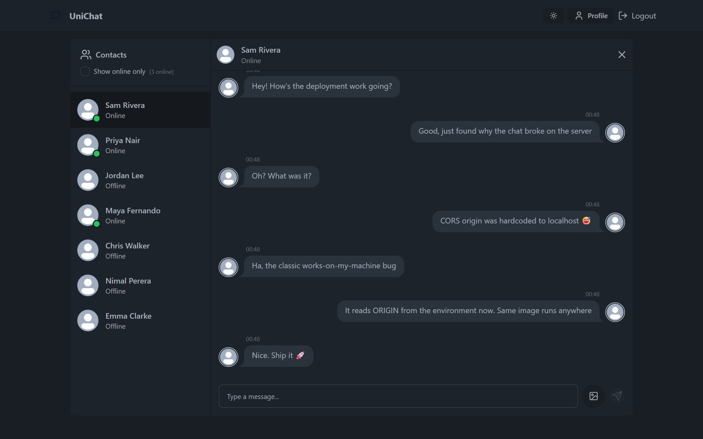
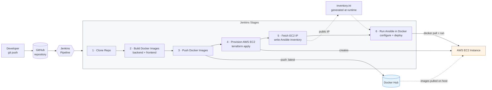
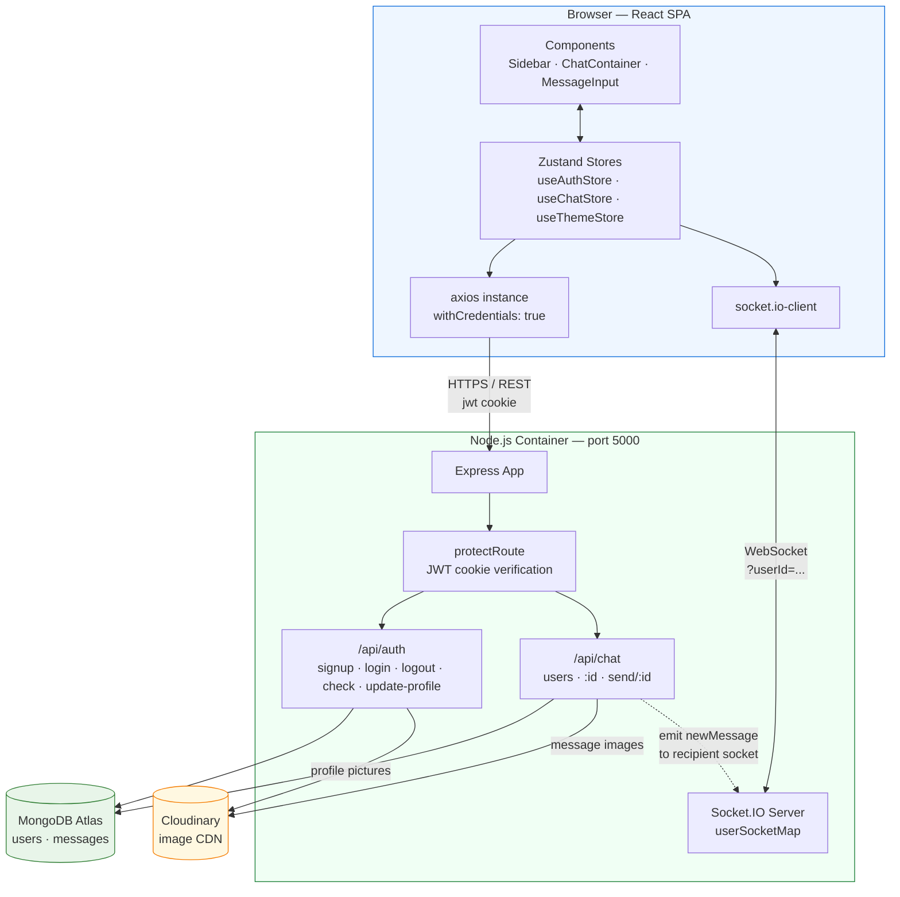
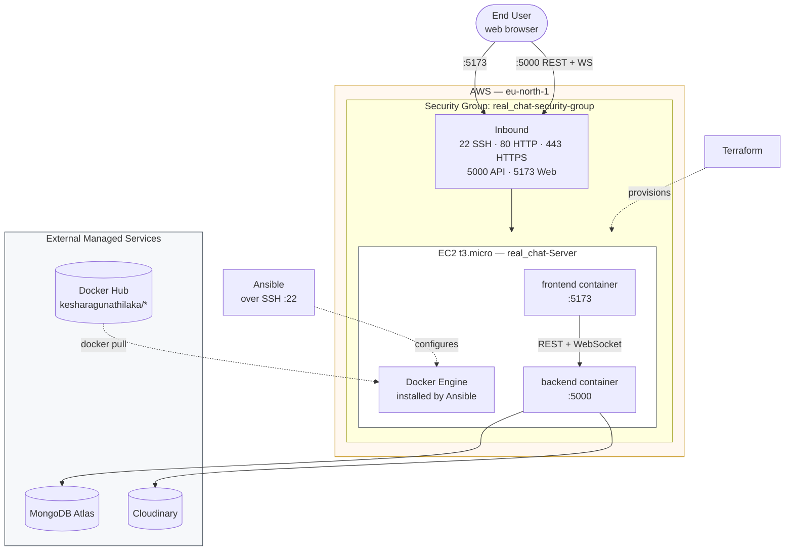
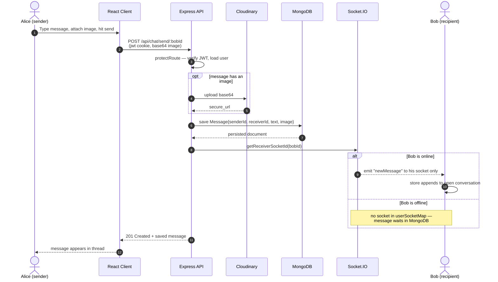
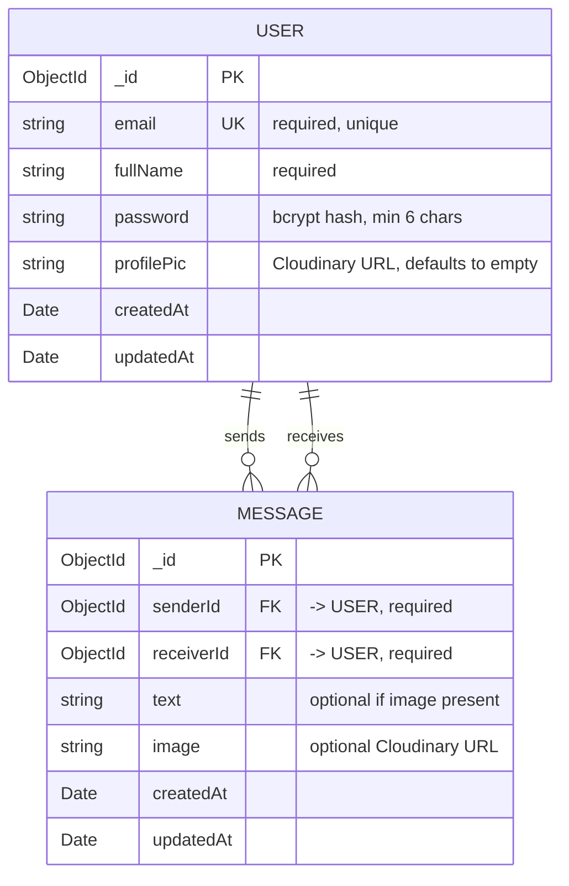
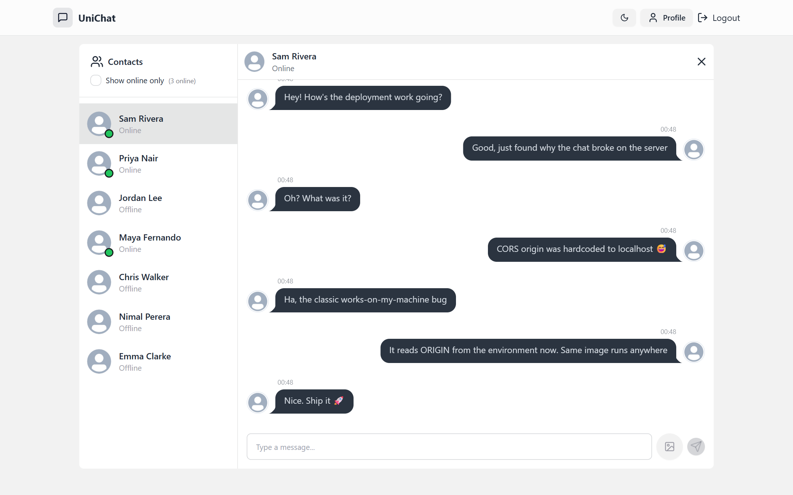
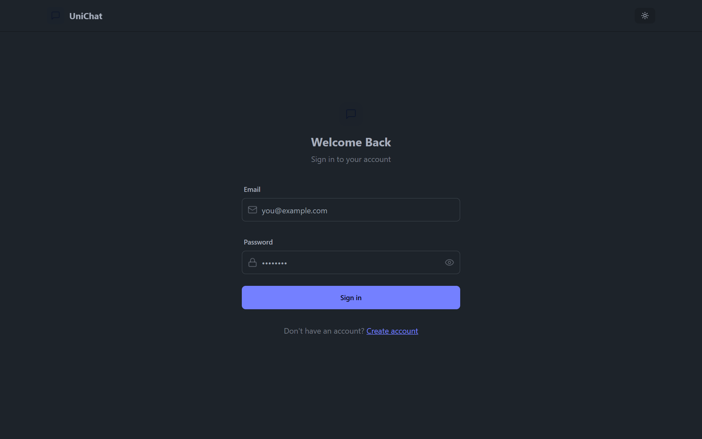

# Real-Time Chat — MERN Application with a Full CI/CD & IaC Pipeline

> A one-to-one real-time chat application, deployed to AWS by a six-stage Jenkins pipeline that builds containers, provisions its own infrastructure with Terraform, and configures the server with Ansible — from a single trigger.

[](https://nodejs.org/)
[](https://react.dev/)
[](https://vitejs.dev/)
[](https://socket.io/)
[](https://www.mongodb.com/)
[](https://www.docker.com/)
[](https://www.jenkins.io/)
[](https://www.terraform.io/)
[](https://www.ansible.com/)
[](https://aws.amazon.com/ec2/)
[](LICENSE)



---

## Overview

Deploying a web application by hand is slow, undocumented, and different every time somebody does it. Someone SSHes into a box, pulls a branch, installs a runtime they forgot to write down, and the next person cannot reproduce it.

This project removes that step entirely. A push to the repository triggers a Jenkins pipeline that containerises both tiers of a real-time chat application, publishes the images to Docker Hub, **provisions a brand-new AWS EC2 instance from scratch with Terraform**, reads the public IP that Terraform just created, generates an Ansible inventory from it on the fly, and uses Ansible to install Docker and start the containers on that freshly-created machine.

The result: infrastructure that did not exist when the build started is running the application by the time it finishes, with no manual step in between.

The application itself — **UniChat** — is a one-to-one messaging app — real-time delivery over WebSockets, presence tracking, image attachments, and JWT authentication — chosen because it exercises the parts of a deployment that are genuinely awkward to automate: persistent connections, cross-origin rules, and per-environment configuration.

## Scope & Attribution

Being precise about what is what:

**The DevOps layer is our own work.** Docker images for both tiers, the Jenkins declarative pipeline, the Terraform configuration for EC2 and its security group, the Ansible playbooks, the Terraform-to-Ansible inventory handoff, and the environment-driven configuration model — all built by us for this module.

**The application layer is adapted from an open-source MERN chat implementation.** The React frontend and Express backend are based on a publicly available MERN real-time chat project. We modified it where the deployment required it — most substantially, replacing the hardcoded `localhost` origins that made it undeployable (see [Challenges](#challenges--what-we-learned)) — but we did not write the base application from scratch, and it would be wrong to imply otherwise.

This split is deliberate rather than a shortcut. The module assesses the pipeline, not CRUD code, and taking an application you did not write and making it deploy reproducibly is a closer match to real infrastructure work than deploying something built to be convenient for you.

## Features

**Application**
- Real-time one-to-one messaging over WebSockets — no polling, no refresh
- Live online/offline presence, updated as users connect and disconnect
- Image attachments, uploaded to Cloudinary rather than stored on the app server
- JWT authentication in an `httpOnly`, `sameSite=strict` cookie — not `localStorage`
- bcrypt password hashing with a per-user generated salt
- 32 selectable UI themes with light/dark support, persisted across sessions

**Infrastructure**
- Both tiers containerised, with published images on Docker Hub
- Six-stage Jenkins declarative pipeline, credentials injected via Jenkins' credential store
- EC2 instance and security group defined as code in Terraform
- Ansible playbook for Docker installation and container lifecycle
- Dynamic inventory: Terraform's IP output feeds Ansible in the same run
- Ansible runs inside a container, so the Jenkins agent needs no Ansible install
- Environment-driven configuration — the same image runs locally and on AWS

## Tech Stack

| Layer | Technology |
|---|---|
| Frontend | React 18, Vite 6, Zustand, Tailwind CSS, daisyUI, Framer Motion |
| Backend | Node.js 18, Express 4, Socket.IO 4 |
| Database | MongoDB (Atlas), Mongoose ODM |
| Auth | JSON Web Tokens, bcryptjs, httpOnly cookies |
| Media | Cloudinary |
| Logging | Winston (console + file transports) |
| Containers | Docker, Docker Compose |
| CI/CD | Jenkins (declarative pipeline) |
| IaC | Terraform (AWS provider) |
| Config Mgmt | Ansible |
| Cloud | AWS EC2 (`eu-north-1`, `t3.micro`) |

## Architecture

> **Interactive version:** [`docs/architecture.html`](docs/architecture.html) is a self-contained
> animated walkthrough of both diagrams below — step through the pipeline stage by stage, or follow a
> single chat message from one browser to another. Clone the repo and open it in any browser; no build
> step and no network access required.

### CI/CD Pipeline

One trigger takes the project from source to running infrastructure. Stages 4 and 5 are the interesting pair: Terraform creates a server that did not previously exist, and its output becomes Ansible's inventory within the same build.



### Application Architecture

The browser holds **two** connections to the backend at once: REST for request/response work, and a persistent WebSocket for anything that has to arrive without being asked for. Both must agree on the same allowed origin — which is exactly where this project's most instructive bug lived.



### Deployment Topology



## How a Message Travels

The part worth understanding: sending a message uses **two different transports**. The sender gets an HTTP response confirming persistence; the recipient gets a WebSocket push targeted at their specific socket ID — not a broadcast. Users who are offline simply have no socket in the map, and collect the message from the database when they next open the conversation.



## Data Model

Two collections. `Message` carries a self-referencing pair of user references — sender and recipient both point back to `User`, which is what makes a conversation query a single `$or` over both directions.



## Getting Started

### Prerequisites

| Tool | Version | Needed for |
|---|---|---|
| Node.js | 18+ | Running locally |
| npm | 9+ | Dependencies |
| Docker + Compose | 20+ | Container workflow |
| Terraform | 1.5+ | AWS provisioning |
| Ansible | 2.14+ | Or use the containerised run |
| MongoDB Atlas | free tier | Database |
| Cloudinary | free tier | Image uploads |
| AWS account | — | EC2 deployment |

### Environment Variables

Copy the example files and fill in real values. Both `.env` files are gitignored and excluded from the Docker build context — no secrets are committed to this repository.

```bash
cp backend/.env.example backend/.env
cp frontend/.env.example frontend/.env
```

**`backend/.env`**

| Variable | Description |
|---|---|
| `PORT` | API listen port. Defaults to `5000` if unset. |
| `NODE_ENV` | `development` or `production`. Anything other than `development` marks the auth cookie `Secure` (HTTPS only). |
| `ORIGIN` | Origin allowed by CORS — for **both** REST and the Socket.IO handshake. Must exactly match the URL the browser loads, port included, no trailing slash. |
| `LOG_LEVEL` | Winston level: `error`, `warn`, `info`, `debug`. Defaults to `info`. |
| `MONGO` | MongoDB connection string. |
| `JWT_SECRET` | Long random string for signing tokens. |
| `CLOUDINARY_CLOUD_NAME` / `CLOUDINARY_API_KEY` / `CLOUDINARY_API_SECRET` | Cloudinary dashboard credentials. |

**`frontend/.env`**

| Variable | Description |
|---|---|
| `VITE_API_BASE_URL` | Base URL for REST calls. Unset falls back to relative `/api`. |
| `VITE_BASE_URL` | Origin for the Socket.IO client (no `/api` suffix). |

> Only variables prefixed `VITE_` are exposed to browser code — never put a secret in one.

### Run Locally

```bash
git clone https://github.com/KesharaGunathilaka/DevOps_RealTimeChat.git
```

Backend, in one terminal:

```bash
cd backend && npm install && npm run dev
```

Frontend, in a second:

```bash
cd frontend && npm install && npm run dev
```

Open <http://localhost:5173>. To see real-time delivery, sign up as two different users in two browser profiles (or one normal window and one private window — a shared cookie jar will log you out of the first account).

### Run with Docker Compose

```bash
docker compose up --build
```

Frontend on `:5173`, backend on `:5000`. `backend/.env` supplies the API's configuration. Note that Compose here does **not** start a MongoDB container — `MONGO` should point at Atlas or another reachable instance ([Known Limitations](#known-limitations)).

## Deploying to AWS

> The steps below reflect the configuration in this repository. They were **not** re-executed against a live AWS account in the most recent documentation pass — the demo instance has been torn down to avoid charges. `terraform validate` passes and the Compose file resolves; treat the cloud steps as reproducible instructions rather than a freshly-verified run.

### 1. Provision with Terraform

Requires an EC2 key pair named `key1` in `eu-north-1`, with the private key available to Ansible.

```bash
terraform -chdir=terraform init
terraform -chdir=terraform apply
terraform -chdir=terraform output -raw instance_public_ip
```

This creates a `t3.micro` and a security group opening ports 22, 80, 443, 5000, and 5173.

### 2. Configure & Deploy with Ansible

Write an inventory pointing at the IP from the previous step:

```ini
[ec2]
<public-ip> ansible_user=ubuntu ansible_ssh_private_key_file=/path/to/key1.pem
```

Then run the playbook — it installs Docker, pulls both images, and starts the containers:

```bash
ansible-playbook -i inventory.ini ansible/playbook.yml
```

Set `ORIGIN` on the backend container to `http://<public-ip>:5173` and the frontend's `VITE_*` variables to the matching public IP. Leaving `ORIGIN` unset falls back to `localhost` and the browser will block every request.

### 3. Running the Jenkins Pipeline

Create these credentials in Jenkins (**Manage Jenkins → Credentials**), matching the IDs in [`jenkins/Jenkinsfile`](jenkins/Jenkinsfile):

| Credential ID | Type |
|---|---|
| `DOCKERHUB_PASS` | Secret text — Docker Hub access token |
| `AWS_ACCESS_KEY` | Secret text |
| `AWS_SECRET_KEY` | Secret text |

Point a Pipeline job at this repository with the script path `jenkins/Jenkinsfile` and build. The pipeline runs stages 1–6 as shown in the [CI/CD diagram](#cicd-pipeline).

> **Agent requirement:** the pipeline uses `bat` steps and therefore requires a **Windows** Jenkins agent with Docker and Terraform on `PATH`. Porting to Linux means swapping `bat` for `sh` throughout.

## Usage

1. **Sign up** — full name, email, password (6+ characters). A JWT cookie is issued on success.
2. **Pick a contact** from the sidebar. "Show online only" filters to users with a live socket.
3. **Send a message** — text, an image, or both. It appears instantly for any recipient who is online.
4. **Set a profile picture** on the Profile page; it uploads to Cloudinary and the URL is stored on the user.
5. **Change theme** in Settings — 32 daisyUI themes, persisted in `localStorage`.

### Screenshots

| Light theme | Sign-in |
|---|---|
|  |  |

Captured from a local run against a demo MongoDB instance, using seeded demo accounts. The green presence dots are live — the three "Online" contacts each had a real browser session holding an open WebSocket while these were taken.

## Testing

**There is no automated test suite yet** — this is the most significant gap in the project, and it is stated plainly rather than hidden. `npm test` in `backend/` is still the npm-generated placeholder that exits non-zero.

What *is* verified, and how to reproduce it:

```bash
cd backend  && npm install && node --check server.js   # backend parses
cd frontend && npm install && npm run build            # production build succeeds
cd frontend && npm run lint                            # ESLint
terraform -chdir=terraform init -backend=false
terraform -chdir=terraform validate                    # IaC is valid
docker compose config                                  # Compose resolves
```

Most recent run: the frontend builds cleanly (1,680 modules → 287 kB JS, 92 kB gzipped), `terraform validate` reports success, and the Compose file resolves. Backend fail-fast behaviour was confirmed by pointing `MONGO` at an unreachable URI: the process logs the error and exits `1` instead of listening.

See [Future Improvements](#future-improvements) for the intended test plan.

## Project Structure

```
.
├── ansible/
│   ├── playbook.yml          # canonical: install Docker, pull images, run containers
│   ├── deploy.yml            # earlier variant (see Known Limitations)
│   ├── setup-docker.yml      # earlier variant — Docker install only
│   └── inventory.ini         # placeholder; the real inventory is generated by Jenkins
├── backend/
│   ├── controllers/          # authController, chatController
│   ├── lib/                  # db, socket, cloudinary, jwt utils
│   ├── middlewares/          # protectRoute — JWT cookie verification
│   ├── models/               # User, Message (Mongoose schemas)
│   ├── routes/               # authRoutes, chatRoutes
│   ├── utils/logger.js       # Winston logger
│   ├── Dockerfile
│   └── .env.example
├── frontend/
│   ├── src/
│   │   ├── components/       # Sidebar, ChatContainer, MessageInput, Navbar …
│   │   ├── pages/            # Home, Login, SignUp, Profile, Settings
│   │   ├── store/            # Zustand: auth, chat, theme
│   │   └── lib/              # axios instance, helpers
│   ├── Dockerfile
│   └── .env.example
├── jenkins/Jenkinsfile       # six-stage declarative pipeline
├── terraform/main.tf         # EC2 instance + security group + IP output
├── docker-compose.yml
└── LICENSE
```

## Challenges & What We Learned

**An application that runs is not an application that deploys.**
The base app worked perfectly on `localhost` and broke completely on EC2. The cause was a single line:

```js
const Origin = "http://localhost:5173" || process.env.ORIGIN;
```

`||` returns its first truthy operand — and a non-empty string is always truthy, so `process.env.ORIGIN` was unreachable code. The environment variable existed, was documented, was set correctly on the server, and was never once read. Every cross-origin request from the deployed frontend was rejected by CORS.

Two things made this hard to spot. It is not a syntax error, a warning, or a failing test — it is valid JavaScript that does something other than what it looks like. And it only manifests in the one environment that is hardest to debug. The same hardcoded origin appeared independently in the Socket.IO CORS config, so fixing one still left real-time messaging broken. The lesson we actually took: **configuration that never varies during development is exactly the configuration nobody tests.**

**The build context is part of the deployment.**
`frontend/.env` pointed at `localhost:5000`. It was correctly gitignored — but `.dockerignore` did not exclude it, so `COPY . .` baked it into the image. The deployed frontend, running on a public EC2 instance, was politely asking *the visitor's own laptop* for its API. Gitignore and dockerignore answer different questions: one is about what you publish to source control, the other about what you publish to a container registry.

**Passing state between tools that do not know about each other.**
Terraform knows the IP of the machine it just created. Ansible needs that IP to configure it. Neither has any notion of the other. The pipeline bridges them by capturing `terraform output -raw instance_public_ip` and writing an inventory file at runtime, so infrastructure created in stage 4 is addressable in stage 6 of the same build. Running Ansible inside `williamyeh/ansible:alpine3` rather than installing it on the agent kept the Jenkins host disposable — a useful habit when the agent is a Windows machine that has no business hosting a Python toolchain.

**Fail loudly, and early.**
`connectDB()` originally ran inside the `server.listen` callback and logged failures without exiting. A container with an unreachable database would start, report healthy, bind its port, and return 500s to every request. Moving the connection *before* `listen` and exiting non-zero on failure means the container dies immediately and visibly — a crash-looping container is a far better diagnostic than a running one that silently serves nothing.

## Known Limitations

Documented deliberately. These are understood, not undiscovered.

| Area | Limitation |
|---|---|
| **Frontend image** | The Dockerfile runs `npm run dev` — the Vite **dev server** — as its entrypoint. It works, but it ships HMR and unminified assets. A multi-stage build serving `dist/` via nginx is the correct fix. |
| **No test suite** | No unit, integration, or end-to-end tests. The pipeline builds and deploys unverified code. |
| **No pipeline quality gate** | No lint, test, or `terraform validate` stage. Three pre-existing ESLint errors (`vite.config.js`, `tailwind.config.js`, a vendored `magicui` component) would need resolving before a lint gate could pass. |
| **SSH open to the world** | The security group allows port 22 from `0.0.0.0/0`. It should be restricted to a known admin CIDR. |
| **Local Terraform state** | No remote backend. State lives on whichever Jenkins agent ran last — unshared, unlocked, and unencrypted. S3 + DynamoDB is the standard remedy. |
| **Compose has no database** | `docker-compose.yml` defines no MongoDB service, so `MONGO` must point at an external instance. |
| **Duplicate Ansible playbooks** | `deploy.yml` and `setup-docker.yml` are earlier variants of `playbook.yml`, kept for history. Only `playbook.yml` is invoked by the pipeline. |
| **Jenkins IP capture** | `bat(returnStdout: true)` includes the echoed command line in its output, so the captured IP needs `@echo off` to be reliably clean. |
| **Windows-only pipeline** | All pipeline steps use `bat`. A Linux agent needs them changed to `sh`. |
| **Unused dependencies** | `morgan`, `body-parser`, and `cloudinary_js` are declared in `backend/package.json` but imported nowhere. |
| **Single-region, single-instance** | One `t3.micro`, no load balancer, no auto-scaling, no HTTPS termination. Appropriate for the module's scope, not for production. |
| **`node_modules` in history** | `backend/node_modules/` was committed early on. It is untracked going forward, but remains in earlier commits — purging it would require rewriting history and breaking every existing clone. |

## Future Improvements

- **Multi-stage frontend build** — `npm run build` → nginx, for a smaller, production-appropriate image
- **Test suite** — Vitest + Supertest on the auth flow (signup validation, duplicate email, wrong password, JWT issuance) and the chat routes, plus a Socket.IO delivery test
- **Pipeline quality gate** — lint, test, `terraform validate`, and image vulnerability scanning before any deploy stage
- **Remote Terraform state** — S3 backend with DynamoDB locking
- **Zero-downtime deploys** — health-checked rolling replacement instead of `docker run` on a bare host
- **HTTPS** — an ALB or Caddy/nginx with Let's Encrypt, so the auth cookie's `Secure` flag is meaningful
- **Group chat and message history pagination** — the schema supports the first with a conversation collection; the second matters as soon as a thread grows
- **Read receipts and typing indicators** — natural extensions of the existing socket layer
- **Centralised logging** — ship the Winston output somewhere queryable rather than to a file inside an ephemeral container

## Team

Built jointly for the DevOps module by:

- **Keshara Gunathilaka**
- **Akila**

Both members collaborated across the whole project — containerisation, the Jenkins pipeline, Terraform, and Ansible. Commits were pushed from a single account, so the contributor graph shows one author.

## License

Released under the [MIT License](LICENSE).

The application layer is adapted from an open-source MERN chat implementation, as described in [Scope & Attribution](#scope--attribution); credit for that work belongs to its original authors.
